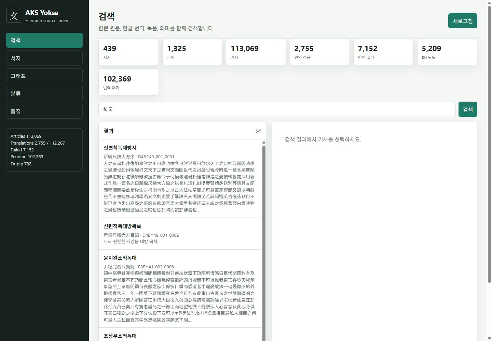

# AKS Yoksa Tree Snapshot

한국학중앙연구원 장서각 `고도서 > 본문텍스트 > 서명별` 공개 자료를 `legalize-kr` 스타일의 경로 기반 트리로 정돈한 진행형 데이터 저장소입니다.

원문 한문을 canonical 데이터로 유지하고, 한국어 번역, 독음, 의미 요약, 엔티티 후보는 파생 레이어로 누적합니다.

## 프로젝트 문서

- `PROJECT.md`: MiMo 신청 근거로 사용할 프로젝트 설명
- `ROADMAP.md`: 원문 공개, 번역, 색인, 지식 그래프 계획
- `STATUS.md`: 현재 번역 큐와 진행 현황
- `_index/translation_status.json`: 기계 처리용 진행 현황 스냅샷
- `_index/translations_progress.jsonl`: 현재까지의 번역 성공/실패 시도 로그

## 저장 구조

- `kr/{서명}/README.md`: 서명 요약
- `kr/{서명}/서지.json`: 서지 메타데이터
- `kr/{서명}/해제.md`: 해제 원문
- `kr/{서명}/{권책}/{기사}.md`: 사람이 읽는 기사 원문/번역
- `kr/{서명}/{권책}/{기사}.json`: 기계 처리용 기사 레코드
- `_index/books.jsonl`: 서지 색인
- `_index/articles.jsonl.zip`: 기사 색인 압축본
- `_index/translations_progress.jsonl`: 번역 진행 스냅샷

## 현재 규모

- 서지: 439건
- 권책: 1,325건
- 기사: 113,150건
- 본문 있는 번역 대상: 112,287건
- 최근 스냅샷 기준 번역 성공: 2,755건
- 최근 스냅샷 기준 번역 실패: 7,156건
- 지식 그래프 색인: 노드 5,209개, 엣지 9,300개

## 진행 화면

## 현재 전략

한문 원문을 먼저 공개하고, 한국어 번역은 SQLite 작업 큐 기반으로 계속 누적합니다. 실패 결과도 오류 사유와 함께 보존하여 MiniMax 및 MiMo 재처리 근거로 사용합니다.

이 저장소는 완성본이 아니라 진행 중인 공개 작업물입니다. MiMo 토큰 확보 후 번역 및 품질 개선 결과를 같은 구조에 계속 반영할 예정입니다.

---

# English Summary

This repository is a work-in-progress public snapshot of the AKS Yoksa classical text project. It reorganizes publicly accessible Jangseogak source materials from the Academy of Korean Studies into a path-based tree inspired by the `legalize-kr` repository style.

The project keeps the original Classical Chinese source text as the canonical layer. Korean translation, Korean reading, semantic summary, and entity candidates are stored as derivative layers.

## Purpose

The immediate goal is to publish a verifiable source-text tree and a translation progress snapshot that can support a MiMo token application. After additional model credits are secured, the translation and indexing layers will be updated continuously.

## Scope

- Source: `http://yoksa.aks.ac.kr/jsp/aa/BookList.jsp?fcs=s&fcsd=st`
- Books: 439
- Volumes: 1,325
- Articles: 113,150
- Articles with translatable body text: 112,287

## Data Layout

- `kr/{book}/README.md`: book-level summary
- `kr/{book}/서지.json`: bibliography metadata
- `kr/{book}/해제.md`: explanatory text when available
- `kr/{book}/{volume}/{article}.md`: human-readable source text and translation fields
- `kr/{book}/{volume}/{article}.json`: machine-readable article record
- `_index/books.jsonl`: book index
- `_index/articles.jsonl.zip`: compressed article index
- `_index/translations_progress.jsonl`: current translation attempt log
- `_index/translation_status.json`: machine-readable progress snapshot

## Translation Strategy

Translation is managed through a SQLite-backed work queue with `pending`, `running`, `ok`, and `failed` states. Failed attempts are preserved with error reasons so that later MiniMax or MiMo runs can retry them by failure type.

The intended MiMo usage includes:

- retrying failed translations by error class,
- generating Korean readings for Classical Chinese text,
- producing natural Korean translations,
- summarizing historical meaning and context,
- extracting person, place, office, and work-title candidates,
- preparing evidence-linked nodes for future knowledge graph indexing.

## Status

This is not a final corpus release. It is a progress snapshot for transparent review, model-credit application, and continued public versioning.

The latest dashboard snapshot shows 2,755 completed translations, 7,156 preserved failed attempts, 102,369 pending jobs, and a rebuilt knowledge-graph index with 5,209 nodes and 9,300 edges.
